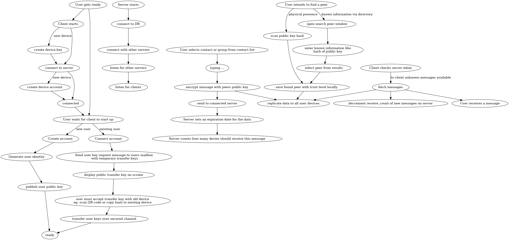

# igel (pronounced eagle)

Igel is the best chat software written by the most capable, inclusive, humble, and disruptive rust developers living today.

This software is made of 100% cyber and therefore provides 100% cyber security.
Note: std deviation currently resides around approximatly 0.42 cyber.

## features

- [ ] a fun (cyber) easter egg
- [ ] sending texts
- [ ] sending pictures
- [ ] sending arbitrary binary data
- [ ] receiving texts
- [ ] receiving pictures
- [ ] receiving arbitrary binary data
- [ ] colour coded text to express moods and irony
- [ ] end to server encryption (maybe TLS?)
- [ ] end to end encryption
- [ ] groups
- [ ] multi cyber device support
- [ ] cyber device verification
    - [ ] local device specific key creation
- [ ] local cyber storage
    - [ ] add cyber encryption with password or machine UUID.
- [ ] server persistence for:
    - [ ] offline users (incoming mailbox)
    - [ ] offline devices (multi device)
    - [ ] offline users (discoverability for other users)
    - [ ] offline devices (user manages lost/new devices)

## Design

The user will use a webbrowser (chromium or firefox) with websockets connecting to his/her local igel.

The client connects to a server over an encrypted channel.
Signing up a device should happen at this point.
There is no automatic transfer of user keys.

The server stores only the most needed information:

* Per User
    * public key and hash of public key
    * list of connected devices
    * inbox for encrypted messages
    * optional username
* Per device
    * user encrypted device name
    * last seen timestamp
    * Connection state: online (has connection), push (reacable over push) or offline (long gone, device may not count for message delivery count anymore)
    * push handle (params for GCM or Apple Push)
* Per Group
    * UUID: eg. hash of public key
    * last checked date (to cleanup abadoned groups)
    * inbox for encrypted messages

A group is a special user account, where the private key is shared among many users.

Inviting a user means sending the private key of the group to the new user.

Removing a user means generating a new key pair and distributing it to everybody except the user to be left out.
This may mean that this will require a new group. However the process should be transparent to the users.

## Well-known

```
| Key                                 | Value |
|-------------------------------------|-------|
| The clients http and websocket port | 4280  |
| Servers default listen port         | 4242  |
```

## Development

This project requieres rust 1.20.0 or later.

### rendering stats diagram:

```bash
dot -T png states.dot -O
```



### TODO

- [ ] CI (travis?)
- [ ] fancy logo (flying igel?)
- [ ] conference talk
- [ ] more users
- [ ] privacy by design (requires more servers and more users)